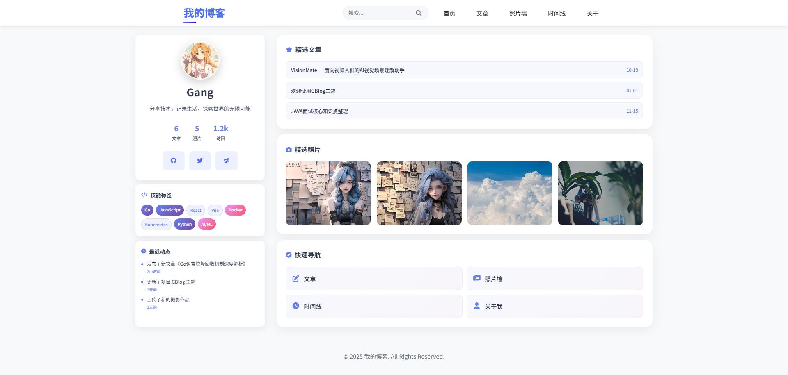

# GBlog - Hugo 个人博客主题

预览: [orz-ai.github.io](https://orz-ai.github.io)

一个基于 Hugo 的现代化个人博客主题，集成了文章发布、照片墙、时间线等功能。

## 特性

- **文章管理** - 支持 Markdown 格式文章发布
- **照片墙** - 优雅的照片展示和管理功能
- **时间线** - 按时间顺序展示文章和照片
- **搜索功能** - 全站内容搜索
- **响应式设计** - 完美适配各种设备
- **现代化UI** - 简洁美观的用户界面
- **快速加载** - 优化的性能表现

## 快速开始

### 环境要求

- [Hugo](https://gohugo.io/) v0.100.0 或更高版本
- Git

### 安装步骤

1. **克隆项目**
   ```bash
   git clone https://github.com/yourusername/gblog.git
   cd gblog
   ```

2. **启动开发服务器**
   ```bash
   hugo server -D
   ```

3. **访问网站**
   打开浏览器访问 http://localhost:1313

## 使用指南

### 发布文章

创建新文章：
```bash
hugo new posts/my-new-post.md
```

编辑生成的 Markdown 文件，添加内容后保存即可。

### 添加照片

1. **创建照片内容**
   ```bash
   hugo new photos/my-photo.md
   ```

2. **编辑照片信息**
   ```yaml
   ---
   title: "照片标题"
   date: 2024-01-01T12:00:00+08:00
   draft: false
   image: "/images/photos/my-photo.jpg"
   location: "拍摄地点"
   camera: "相机型号"
   tags: ["标签1", "标签2"]
   ---
   
   照片描述内容...
   ```

3. **上传照片文件**
   将照片文件放置在 `static/images/photos/` 目录下

### 自定义配置

编辑 `hugo.toml` 文件来自定义网站配置：

```toml
baseURL = "https://yourdomain.com/"
title = "你的博客标题"
theme = "gblog"

[author]
  name = "你的名字"
  email = "your-email@example.com"

[params]
  description = "博客描述"
  keywords = ["关键词1", "关键词2"]
```

## 项目结构

```
gblog/
├── archetypes/          # 内容模板
├── content/             # 网站内容
│   ├── posts/          # 文章目录
│   ├── photos/         # 照片目录
│   └── timeline/       # 时间线页面
├── static/             # 静态资源
│   └── images/         # 图片资源
├── themes/gblog/       # 主题文件
├── hugo.toml          # Hugo 配置文件
└── README.md          # 项目说明
```

## 功能详解

### 照片墙功能

- 网格式照片展示
- 点击查看大图和详情
- 键盘导航支持（左右箭头）
- 照片元数据展示（地点、相机等）
- 标签分类功能

### 时间线功能

- 按年份分组展示
- 文章和照片混合显示
- 可折叠的年份节点
- 优雅的时间轴设计

### 搜索功能

- 全站内容搜索
- 实时搜索结果
- 高亮匹配内容

## 自定义开发

### 修改主题样式

主要样式文件位于：
- `themes/gblog/static/css/style.css`

### 自定义模板

模板文件位于：
- `themes/gblog/layouts/` - 页面模板
- `themes/gblog/layouts/partials/` - 组件模板

## 部署

### GitHub Pages

1. 在 GitHub 创建仓库
2. 推送代码到仓库
3. 在仓库设置中启用 GitHub Pages
4. 选择 GitHub Actions 作为构建源

### Netlify

1. 连接 GitHub 仓库到 Netlify
2. 设置构建命令：`hugo --minify`
3. 设置发布目录：`public`

### Vercel

1. 导入 GitHub 仓库到 Vercel
2. Vercel 会自动检测 Hugo 项目并配置构建设置

## 贡献

欢迎提交 Issue 和 Pull Request 来改进这个项目！

## 许可证

本项目采用 MIT 许可证 - 查看 [LICENSE](LICENSE) 文件了解详情。